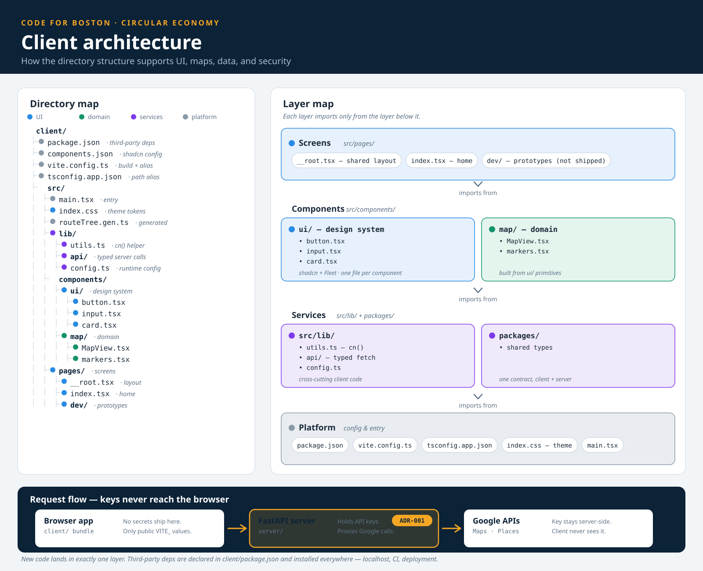

# Client

Client-side application for the Boston Circular Economy project.

## Architecture

The client is organized into four layers. Each layer imports only from the
layer below it so new code has one clear home.

### The four layers

**Screens** — `src/pages/`. These are the app's routes. `__root.tsx` holds the
shared layout, `index.tsx` is the home page, and `dev/` holds prototypes. See
[Routes](#routes) for the routing conventions.

**Components** — `src/components/`. Reusable presentation components belong in
`ui/`; feature components belong in domain folders such as `map/`. Domain
components should compose reusable UI components instead of duplicating them.

**Services** — `src/lib/` and the repository's `packages/` directory.
Cross-cutting client code such as typed API calls and runtime configuration
belongs in `src/lib/`. Data contracts shared with the server belong in
`packages/`.

**Platform** — configuration and entry files. `package.json` declares
third-party code, `vite.config.ts` configures the build, `tsconfig.app.json`
configures TypeScript, `index.css` holds shared styles, and `main.tsx` starts
the app.

### Where new code goes

- Add routes and route-only UI under `src/pages/`.
- Add reusable presentation components under `src/components/ui/`.
- Give each feature area a domain folder under `src/components/`, such as
  `src/components/map/`.
- Put shared client code and typed server calls under `src/lib/`.
- Put data shapes shared with the server under `packages/`.

Keep existing code in place unless a separate change deliberately moves it.
New code should land in exactly one layer.

### Dependencies

Declare third-party code in `client/package.json` and commit the corresponding
lockfile changes so local development, CI, and deployment install the same
versions. Use `dependencies` for code required by the shipped app and
`devDependencies` for build, lint, and development tools.

The component library and design-system implementation have not been selected.
Do not add library-specific setup or dependencies based on this architecture;
update this guide after the project makes that decision.

### Security

API keys must never enter the browser bundle. The server holds private keys and
proxies third-party API calls, while the client receives only public `VITE_`
configuration. Keep authentication and request handling centralized under
`src/lib/` so the security boundary stays easy to review.

## Routes

This project uses [TanStack Router](https://tanstack.com/router) with file-based routing. Routes are defined as files under `src/pages/`, and the router configuration is auto-generated from that directory.

- `src/pages/__root.tsx` — root layout wrapping all routes (shared nav, providers, etc.)
- `src/pages/index.tsx` — the `/` home route
- `src/pages/dev/` — development/prototype-only routes

To add a new route, create a file at the corresponding path under `src/pages/`. Each file must export a `Route` created with the appropriate TanStack Router helper (`createFileRoute`, `createRootRoute`, etc.). See the [TanStack Router file-based routing docs](https://tanstack.com/router/latest/docs/routing/file-naming-conventions) for routing syntax.

| File | Route |
|------|-------|
| `src/pages/index.tsx` | `/` |
| `src/pages/about.tsx` | `/about` |
| `src/pages/items/index.tsx` | `/items` |
| `src/pages/items/$id.tsx` | `/items/:id` |
| `src/pages/resources/get-involved.tsx` | `/resources/get-involved` |

### Route components

Components used only by a single route live in a `-components/` directory next to that route's `index.tsx`.

| File | Used by |
|------|---------|
| `src/pages/items/-components/ItemCard.tsx` | `src/pages/items/index.tsx` |
| `src/pages/items/-components/ItemDetail.tsx` | `src/pages/items/$id.tsx` |

The `-` prefix ensures these directories are not treated as route segments by TanStack Router.
