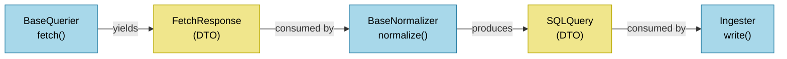

# Data Collectors

```mermaid
flowchart LR
    FetchResponse["FetchResponse<br/>(DTO)"]
    SQLQuery["SQLQuery<br/>(DTO)"]

    Querier["BaseQuerier<br/>fetch()"]
    Normalizer["BaseNormalizer<br/>normalize()"]
    Ingester["Ingester<br/>write()"]

    Querier -->|yields| FetchResponse
    FetchResponse -->|consumed by| Normalizer
    Normalizer -->|produces| SQLQuery
    SQLQuery -->|consumed by| Ingester

    style FetchResponse fill:#f0e68c,stroke:#b8a800,color:#000
    style SQLQuery fill:#f0e68c,stroke:#b8a800,color:#000
    style Querier fill:#a8d8ea,stroke:#2a7fa5,color:#000
    style Normalizer fill:#a8d8ea,stroke:#2a7fa5,color:#000
    style Ingester fill:#a8d8ea,stroke:#2a7fa5,color:#000
```
