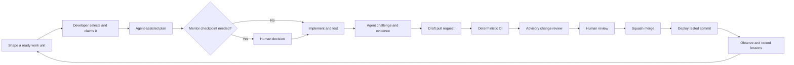

# AI-Assisted Delivery Playbook

Status: **Proposed pilot**  
Owner: Circular Economy engineering team  
Review cadence: after the first three merged pilot work units

## Outcome

This pilot gives volunteer developers a reliable path from a useful idea to a deployed, reviewed change. AI agents reduce setup, planning, and review effort. Human contributors and mentors retain product judgment, accountability, approval, and merge authority.

The first release addresses three observed project constraints:

1. Pull requests do not currently run continuous integration (CI), while `main` deploys to the public GitHub Pages site.
2. Contributors have asked how to request review and have reported that they cannot assign issues or reviewers.
3. Product leaders are translating research into prioritized GitHub work, while several contributors need work that can be completed asynchronously.

This is a small pilot, not a commitment to a specific AI vendor or an autonomous coding bot.

## Delivery loop



The agent may help at every step, but it cannot silently change the issue's intent, approve its own work, or merge a pull request.

## Roles

One person may hold several human roles. One AI product may perform several agent roles, but use a fresh review context when practical.

Every agent applies the repository
[`make-evidence-based-technical-case`](../.agents/skills/make-evidence-based-technical-case/SKILL.md)
skill. The skill uses Toulmin reasoning to test claims. It uses ASD-STE100-aligned
Simplified Technical English to communicate the result.

An orchestrating agent also applies
[`route-agent-work`](../.agents/skills/route-agent-work/SKILL.md). It sends deterministic
checks to hooks and tools. It sends bounded tasks with objective checks to a lower-cost
agent. The default policy uses Luna for Green work and Terra for Yellow work. It uses
Sol for ambiguous integration and conflicting evidence.

| Role | Owns | Does not own |
|---|---|---|
| Product shaper | User outcome, priority, acceptance criteria | Implementation details |
| Mentor | Scoping help, decision checkpoints, teaching | Writing every line for the contributor |
| Contributor | Plan, implementation, evidence, PR | Unstated product decisions |
| Planning agent | Repo exploration, issue split, plan, risk questions | Priority or scope expansion |
| Build agent | Focused code and test changes | Approval or merge |
| Challenge agent | Counterexamples, failure tests, review evidence | Inventing findings or blocking without evidence |
| Maintainer | Final review, rules, merge, incident response | Treating AI output as proof by itself |
| CI/CD | Repeatable checks and tested deployment | Product judgment |

### Cost-aware routing

Route work in this order:

1. Use a compiler, linter, test, validator, or CI hook for an exact decision.
2. Use a versioned skill or template for a repeated project method.
3. Use a lower-cost agent for a bounded and reversible task with an objective check.
4. Use a high-reasoning agent for cross-subsystem synthesis or unresolved conflict.
5. Use a specialist and a human for high-impact risk and accountable decisions.

Give a subordinate agent one objective, the minimum required context, an output limit,
and a validation command. The orchestrating agent inspects the evidence and integrates
the result. This policy reduces repeated context transfer and avoids model work for
decisions that deterministic automation can make.

The machine-readable defaults are in `delivery-routing.json`. Inspect a proposed route
before delegation. Model output remains advisory and never controls a CI result.

## 1. Shape ready work

Use the **Ready work unit** issue form. A work unit is ready when another contributor can understand it without private context.

Required fields are:

- an observable outcome for a named user or system.
- links to the product requirement, research, parent issue, or design.
- testable acceptance criteria.
- in-scope and out-of-scope boundaries.
- dependencies and unresolved decisions.
- an expected size of one to four focused sessions.
- a risk lane and expected evidence.
- the point where mentoring would help.

Large epics remain useful containers. They are not implementation units. The planning agent should propose vertical slices that each produce an observable result, rather than layers that cannot be tested alone.

### Suggested backlog states

Use GitHub Project fields when a project administrator is available:

`Idea → Needs shaping → Ready → Claimed → In progress → In review → Done`

Do not require contributors to change project fields they lack permission to edit. A comment in the issue and the project Slack channel is a valid claim until permissions improve.

## 2. Select and claim work

A contributor should select the smallest Ready item that matches their interest and available time. Before starting, they should:

1. Comment on the issue with their intended start and next check-in.
2. Share the issue in `#circular-economy` when coordination is needed.
3. Ask a maintainer to assign the issue if self-assignment is unavailable.
4. Create a focused branch from current `main`.

The mentor should favor an end-to-end but narrow outcome. For a first contribution, avoid unresolved authentication, schema migration, or cross-service design work.

## 3. Plan with an agent

Ask the planning agent to read `AGENTS.md`, the issue, relevant READMEs, code, and tests. The plan should contain:

- the behavioral claim.
- the grounds, warrant, and applicable backing for that claim.
- the qualifier, strongest rebuttal, and evidence that would change the recommendation.
- files and boundaries likely to change.
- invariants that must remain true.
- expected, boundary, failure, and regression cases.
- exact validation commands.
- decisions that require a person.
- a proposed split if the unit is too large.

The contributor reviews the plan before implementation. A plausible plan is not evidence that the repository behaves as expected.

## 4. Use risk-based mentor checkpoints

| Lane | Typical work | Required human checkpoint |
|---|---|---|
| Green | Docs, prototype, isolated style, safe refactor | Review at PR |
| Yellow | User behavior, API, data transformation, business logic | Confirm important contract or test approach before the change becomes expensive |
| Red | Auth, privacy, destructive action, migration, critical accessibility | Approve design, threat/failure cases, and recovery plan before implementation |

Use Yellow when uncertain. The lane changes review depth, not whether deterministic CI runs.

## 5. Implement and challenge

The build agent makes the smallest complete change that satisfies the issue. The contributor reads the diff and can explain it.

Apply the repository
[`write-self-explanatory-code`](../.agents/skills/write-self-explanatory-code/SKILL.md)
skill during implementation. The change must expose its purpose, decision owner,
contract, failure behavior, comprehension path, and safe refactor boundary.

Before opening a PR, use a challenge pass with a fresh context when practical. Ask it to find counterexamples in four categories:

- expected behavior.
- boundary values and empty states.
- dependency failure or misuse.
- known regressions.

Every finding must include reproducible evidence. “No actionable finding” is a valid result. Do not reward agents for producing issue or PR volume.

Each finding must explain why its evidence supports the claim. It must limit the claim
to the evidence boundary. It must state a relevant exception or remaining uncertainty.

Use the repository [`review-code-change`](../.agents/skills/review-code-change/SKILL.md)
skill for this pass. A bounded Green review routes to Luna. A bounded Yellow review
routes to Terra. Cross-subsystem review routes to Sol only when integration judgment
is necessary.

## 6. Open an evidence-backed pull request

Use the repository pull request template. A reviewable PR includes:

- one linked work unit.
- one behavioral claim.
- visible grounds, warrant, qualifier, and strongest relevant rebuttal.
- why the design works and why the closest credible alternative was not selected.
- ownership, failure, recovery, and complexity effects.
- the risk lane and scope boundaries.
- checks that ran and checks that did not run.
- screenshots or recordings for visible UI changes.
- substantial AI-assistance disclosure.
- the most important review question and remaining uncertainty.

Open a draft PR early for Yellow and Red work. This creates a stable place for async mentoring without implying that the work is ready to merge.

Follow [`CODE_CHANGE_STANDARD.md`](CODE_CHANGE_STANDARD.md). Use a decision record for
a durable cross-system contract, dependency, external service, or high-impact risk.

## 7. Deterministic CI and deployment

The `CI` workflow starts for every code revision to a pull request against `main` and
every push to `main`. The changed-file router selects applicable application checks
from one versioned policy. The `Submission` workflow validates the pull request record
on code revisions and description edits. Its concurrency group cannot cancel code CI.

| Check | Evidence |
|---|---|
| `Submission / Submission record` | Current pull request structure, reasoning fields, evidence, and accountability |
| `CI / Prose` | Selected language rules, editorial patterns, and high-signal AI cliché checks |
| `CI / Frontend` | Client lint and production build |
| `CI / Server` | Server lint and TypeScript build |
| `CI / ETL` | Locked Python environment, Ruff lint and format checks, and pytest suite |

The router runs all application checks for unknown paths, policy changes, and main-branch
pushes. Unaffected pull-request jobs report a successful skip under job conditions.

The deployment workflow listens for successful CI caused by a push to `main`. It
downloads the tested client artifact from that CI run and deploys it to GitHub Pages.
Pull-request runs cannot deploy.

All third-party GitHub Actions are pinned to full commit SHAs. Workflow tokens receive read-only repository access unless the deployment job needs Pages and identity-token permissions.

Dependency advisory data changes independently from the commit. Dependabot monitors it
outside the deterministic build gate. See [`CI_CD_AGENT_ARCHITECTURE.md`](CI_CD_AGENT_ARCHITECTURE.md)
for event, failure, hook, routing, and deployment contracts.

### Maintainer activation step

After this pilot PR merges, the five checks must complete successfully.
A repository administrator should then add these checks to the **Protect Main Branch**
ruleset:

- `Submission record`
- `Prose`
- `Frontend`
- `Server`
- `ETL`

Keep the current requirements for one approval, last-push approval, resolved threads, squash merge, deletion protection, and non-fast-forward protection. Required checks cannot be selected safely until GitHub has observed their names.

After branch protection is active, connect the repository in Codex settings. Enable
managed Code Review for all pull requests. Automatic review also requires a
team-enabled Codex repository.

Use these repository settings during the pilot:

- Auto review: `Review all PRs`.
- Trigger: `Smart detect (Experimental)`.
- Exhaustive: `Disabled`.
- Credit use: keep the personal credit-overrun option disabled.

Smart detection limits repeated reviews while preserving a review after a material
change. A maintainer requests another pass with `@codex review` when a material update
does not receive one. Change the trigger to `On every push` if the pilot shows missed
updates are more costly than repeated reviews.

The managed reviewer reads each applicable `## Code Review Rules` section in
`AGENTS.md`. It posts advisory GitHub findings. A maintainer can request another pass
after a material update by commenting `@codex review`.

Use `@codex review` as the required hook when automatic review is unavailable. Human
review remains available when the managed integration is unavailable.

Red changes require the repository specialist and human checkpoints. When Codex
Security Review is available, `@codex security review` can add evidence. It does not
replace the specialist or human decision.

See [`0001-pr-review-hooks.md`](decisions/0001-pr-review-hooks.md) for the selected
boundary and the custom GitHub Action alternative.

## 8. Human review

Review the claim and evidence before style. CI owns repeatable lint and build feedback. A human reviewer should focus on:

1. Does the change satisfy the user or system outcome?
2. Did the contributor preserve the important contracts and data assumptions?
3. Do the tests prove the risky behavior rather than only mirror the implementation?
4. Can failure be detected and recovered from?
5. Is the code understandable to the next rotating volunteer?

Cap advisory AI review at three to five high-confidence findings. Each finding should explain impact, evidence, and a concrete next step. The maintainer decides whether a finding blocks merge.

For a local review before the pull request becomes ready, run:

```bash
python3 -B .agents/skills/review-code-change/scripts/run_local_review.py \
  --risk yellow --base origin/main
```

Use `--dry-run` to inspect the selected model without spending tokens. Use
`--task-type integration` only when the review crosses subsystem boundaries. The
runner rejects Red work and names the required escalation.

The runner treats `--risk` as the contributor's declared lane. Versioned path rules
raise the effective lane for clear Yellow or Red surfaces. This floor catches obvious
under-routing but does not prove the lane is correct. A mentor or maintainer confirms
the lane for consequential work.

The default scope reviews the current tracked state against the base. Add
`--scope uncommitted` to review staged, unstaged, and untracked work without branch
history. The runner forces a read-only Codex sandbox.

The `Submission record` job enforces the pull request evidence structure. Its read-only
`pull_request_target` workflow runs from the default branch and checks out only the base
revision. It treats the pull request description as untrusted data and never runs pull
request code. The workflow becomes active for subsequent pull requests after this pilot
enters `main`.

The `Prose` job enforces deterministic language rules in repository files. It applies
sentence rules to Markdown and high-signal editorial checks to prose-bearing files.
Human review assesses accuracy, active voice, term meaning, cadence, Toulmin structure,
and rhetorical fairness.

Do not rewrite a valid technical term or remove a necessary condition only to satisfy
the checker. Correct a false-positive rule through normal code review.

## 9. Learn and improve

After deployment, record production defects, stale-data signals, failed user journeys, and repeated review findings. Put durable knowledge in tests, `AGENTS.md`, a README, or a decision record.

Review this pilot after three merged work units using:

- time from Ready to first PR.
- time from review request to first human response.
- first-run CI pass rate.
- number of PRs reopened or reverted.
- repeated review findings.
- contributor-reported confidence and mentoring usefulness.
- number of ready, unclaimed units suitable for async work.

The goal is safer learning and lower reviewer load, not more AI-generated code.

## Pilot agenda for a hack night

1. Walk through one existing issue using the Ready work unit form.
2. Ask a newcomer and a maintainer to independently identify missing context.
3. Run the planning prompt and compare its questions with the humans' questions.
4. Agree on the risk lane and mentor checkpoint.
5. Open a draft PR and observe the routing job and five required checks.
6. Run one challenge pass and reject any finding without evidence.
7. Capture confusing steps as changes to this playbook.

## Open team decisions

The team should decide these during the pilot rather than encode them prematurely:

- whether substantial AI assistance disclosure remains required or becomes optional.
- who rotates as the weekly mentor and review router.
- the expected response time for Yellow and Red review requests.
- which production signals will gate future backend and ETL deployments.
- whether to install a hosted AI review app after the manual process proves useful.

## Project evidence used for this pilot

- [Team proposal for human-owned, AI-assisted review](https://cfb-public.slack.com/archives/C0AFA66CE2W/p1784830048882729)
- [Contributor question about how to request review](https://cfb-public.slack.com/archives/C0AFA66CE2W/p1785267759352939)
- [Contributor request for asynchronous work](https://cfb-public.slack.com/archives/C0AFA66CE2W/p1788296095242299)
- [Feature-prioritization work unit](https://github.com/codeforboston/boston-circular-economy/issues/45)
- [Current deployment workflow history](https://github.com/codeforboston/boston-circular-economy/actions)
- [Existing main-branch ruleset](https://github.com/codeforboston/boston-circular-economy/rules/12887631)

Implementation references: [GitHub Actions secure-use guidance](https://docs.github.com/en/actions/reference/security/secure-use), [uv in GitHub Actions](https://docs.astral.sh/uv/guides/integration/github/), and [GitHub issue-form syntax](https://docs.github.com/en/communities/using-templates-to-encourage-useful-issues-and-pull-requests/syntax-for-issue-forms).
