# CI/CD and Agent Routing Architecture

## Supported result

The delivery system gives the same changed files to one versioned routing policy. Local
hooks and CI use that policy to select deterministic checks.

Agents can propose work and evidence. They do not decide whether a pull request passes,
approve their own changes, merge code, or deploy from a pull request.

## Delivery sequence

```mermaid
flowchart LR
    A[Ready work unit] --> B[Agent or contributor plan]
    B --> C[Local commit hook]
    C --> D[Local routed push hook]
    D --> E[Pull request submission check]
    E --> F[Changed-file router]
    F --> G[Selected subsystem checks]
    G --> H[Managed advisory review]
    H --> I[Human review]
    I --> J[Protected merge]
    J --> K[Full main-branch CI]
    K --> L[Tested client artifact]
    L --> M[Pages deployment]
```

## Deterministic boundary

A deterministic gate returns the same result for the same repository state, toolchain,
inputs, and policy. These gates do not call a language model.

The repository fixes these inputs:

- npm and uv lockfiles fix dependency resolution.
- `.node-version` and `etl/.python-version` fix runtime versions.
- GitHub Actions use full commit hashes.
- GitHub-hosted jobs use the named Ubuntu 24.04 image.
- `delivery-routing.json` fixes changed-path and agent-routing rules.
- tests fix expected classifier and submission behavior.
- deployment consumes the client artifact produced by the successful CI run.

The Ubuntu image can receive platform updates under the same image name. A container
digest is required if the project later needs byte-identical operating-system inputs.

Dependency advisory data changes over time. Dependabot monitors that data outside the
deterministic build gate. A maintainer evaluates each advisory and proposed update.

## Pull request checks

The `CI` workflow always starts for pull requests to `main`. It does not use workflow
path filters because a filtered required workflow can remain pending.

| Job | Selection | Result |
|---|---|---|
| `Route changes` | Always | Tests the policy and classifies the diff. |
| `Prose` | Always | Checks prose, the submission record, and review policy. |
| `Frontend` | Routed | Installs locked npm dependencies, then lints and builds the client. |
| `Server` | Routed | Installs locked npm dependencies, then lints and builds the server. |
| `ETL` | Routed | Installs the locked uv environment, then runs Ruff and pytest. |

The required check names remain `Prose`, `Frontend`, `Server`, and `ETL`. A job-level
condition reports a successful skip when its subsystem is not affected.

The router fails closed:

- an unknown path selects all application checks.
- a routing policy, hook, or workflow change selects all application checks.
- a routing job failure causes each application check to run and fail immediately.
- a push to `main`, merge-queue check, or manual run selects all application checks.

These rules preserve required check names and prevent a classifier failure from hiding
an application failure.

## Local hooks

The pre-commit framework installs two hook stages from `.pre-commit-config.yaml`.

The commit stage checks prose-bearing changed files. It also runs routing tests when a
routing, hook, or CI file changes.

The commit stage also tests the local review runner when review rules, review skills,
or model routes change. The tests inspect routing without invoking a model.

The push stage uses the source and destination commit IDs supplied by pre-commit for
the push. It runs the full prose scan, routing tests, and applicable application checks.
Manual execution compares `HEAD` with `origin/main` unless the caller supplies another
range. When pre-commit requests all files without a commit range, the runner preserves
that request and runs every application check.

The checks execute in the current worktree. The runner stops when the pushed commit is
not checked out because a successful build of another commit would be false evidence.
Push one checked-out branch at a time for exact local validation. CI validates the pull
request head and remains the merge evidence of record.

The local hook does not run `npm ci` because that command replaces the local dependency
tree. Contributors install locked dependencies before the hook runs. CI creates clean
environments and remains the merge evidence of record.

CI disables npm audit and funding requests during installation. Dependabot owns advisory
monitoring, so the required install step does not depend on changing advisory data.

## Model routing

The agent router is advisory. It selects the least costly executor that can produce
evidence within the task boundary.

| Route | Default executor | Required boundary |
|---|---|---|
| Mechanical | Script, compiler, linter, validator, or test | Exact pass or fail rule |
| Repeated method | Repository skill or template | Stable project method |
| Bounded Green | GPT-5.6 Luna at low effort | Narrow, reversible, objective check |
| Bounded Yellow | GPT-5.6 Terra at medium effort | Named contract and mentor checkpoint |
| Integration | GPT-5.6 Sol at high effort | Ambiguous or cross-subsystem synthesis |
| Red specialist | Specialist plus accountable human | Security, privacy, migration, or destructive risk |
| Intent | Accountable human | Priority, scope, trade-off, approval, or merge |

A Red lane keeps exact mechanical tasks on deterministic tools. It adds the required
human checkpoint before implementation and routes judgment to a specialist.

Current OpenAI guidance describes Luna for cost-sensitive workloads, Terra for balanced
cost and intelligence, and Sol for complex professional work. The repository records
these names as reviewed defaults, not permanent assumptions.

An orchestrator must inspect the route, send minimum context, cap the requested output,
and provide an objective validation command. The orchestrator verifies the result before
integration.

Model output never becomes a required status check. A deterministic tool or human review
must verify every consequential agent claim.

## Advisory review boundary

Managed Codex Code Review is the selected pull request event hook. It reads the root
and nearest `## Code Review Rules` sections. It posts a standard GitHub review when the
integration is enabled.

The pilot configures `Review all PRs`, uses the experimental `Smart detect` trigger,
and disables exhaustive review. Personal credit overrun stays disabled. A maintainer
requests another review after a material update with `@codex review` when smart
detection does not start one. This policy limits repeated review cost without leaving
review responsibility only with the pull request author.

The team should change the trigger to `On every push` if the pilot shows that smart
detection misses material changes. It should enable exhaustive review only when the
added findings justify the extra review cost.

Use `@codex review` as the required managed hook when automatic review is unavailable.
Use human review when the repository cannot use the managed integration.

The managed service selects its own model. The repository model routes apply to local
and delegated review. The local runner uses Luna for bounded Green changes, Terra for
bounded Yellow changes, and Sol for cross-subsystem review.

The local runner requires a declared risk lane. Versioned path rules can raise that
lane but cannot lower it. This check catches clear under-routing, such as authentication
or migration code declared Green. It does not replace a human risk decision, and a
client-side hook cannot enforce policy against `--no-verify`.

The managed reviewer does not receive a repository API secret through GitHub Actions.
The repository does not check out contributor code inside a privileged review workflow.
This boundary removes the fork-secret and untrusted-execution paths from repository CI.

The closest alternative is `openai/codex-action` with an organization API key. The
team can revisit that option when it needs structured findings, an automated gate, and
an owner for secret, budget, and prompt-injection controls.

See `docs/decisions/0001-pr-review-hooks.md` for the complete decision and limits.

## Submission and explainability

Every pull request follows `docs/CODE_CHANGE_STANDARD.md`. The record includes the claim,
evidence, reasoning, selected design, rejected alternative, and limits. It also includes
the comprehension path, refactor boundary, and review question.

The `Prose` job enforces the structure and selected language rules. Human review decides
whether the stated why and why-not match the code and evidence.

Comments explain non-obvious reasons and invariants. Names, types, interfaces, and tests
explain ordinary behavior. This rule avoids comments that repeat implementation syntax.

## Deployment

The deployment workflow starts only after a successful `CI` workflow. Its condition also
requires a push event on the `main` branch.

The `Frontend` job builds and uploads `github-pages-client` during main-branch CI. The
deployment workflow downloads that artifact by the originating workflow run identifier.
It does not rebuild the client.

The deploy job verifies `client/dist/index.html`, packages the Pages artifact, and uses
the Pages environment. Its token can read Actions and repository contents. It can write
Pages and request an identity token.

A failed CI run creates no deployment. A missing or expired artifact fails deployment.
The previous Pages deployment remains the recovery point until another tested artifact
succeeds.

## Change and failure records

Use the pull request for a local design explanation. Add a decision record when the
change crosses a subsystem, public contract, durable state, or high-impact risk boundary.

Record a follow-up issue when a qualifier or rebuttal needs later work. Record a rollback
or incident in a runbook when production recovery requires more than a new deployment.

## Maintainer activation

After merge, confirm one successful `CI` run on `main`. Configure `Prose`, `Frontend`,
`Server`, and `ETL` as required checks in the protected-main ruleset.

Connect the repository in Codex settings. Confirm that it is team-enabled before you
enable automatic review. Otherwise, use `@codex review` on each representative change.

Keep the approval, last-push approval, resolved-thread, squash-merge, deletion, and
non-fast-forward protections. Add the `merge_group` event before enabling a merge queue.

Review routing paths, model defaults, false positives, CI minutes, and model usage after
the first three merged work units.

## Authoritative references

- [GitHub workflow filters and required checks](https://docs.github.com/en/actions/how-tos/write-workflows/choose-when-workflows-run/trigger-a-workflow)
- [GitHub job conditions](https://docs.github.com/en/actions/how-tos/write-workflows/choose-when-workflows-run/control-jobs-with-conditions)
- [GitHub required-check troubleshooting](https://docs.github.com/en/pull-requests/how-tos/merge-and-close-pull-requests/troubleshooting-required-status-checks)
- [Codex GitHub review](https://developers.openai.com/codex/integrations/github)
- [Codex local code review](https://learn.chatgpt.com/codex/code-review)
- [GitHub Actions security](https://docs.github.com/en/actions/reference/security/secure-use)
- [OpenAI model selection](https://developers.openai.com/api/docs/models)
