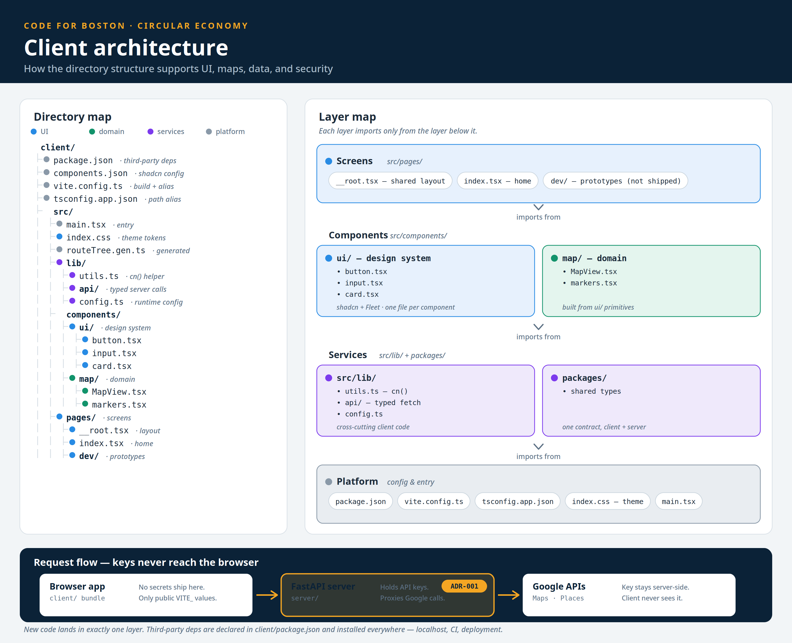

# Client architecture

This page explains how the `client/` folder is organized. It shows where new
code goes and how the app handles maps, data, and security.

## The four layers

The client has four layers. Each layer imports only from the layer below it.
This keeps the code easy to follow and easy to review in small pull requests.

**Screens** — `src/pages/`. These are the app's routes. `__root.tsx` holds the
shared layout. `index.tsx` is the home page. The `dev/` folder holds prototype
pages. Prototype pages do not ship to users.

**Components** — `src/components/`. This layer has two parts. `ui/` is the
design system: one file per component (`button.tsx`, `input.tsx`, `card.tsx`).
These wrap shadcn primitives and carry Boston Fleet styling. Domain folders
like `map/` hold feature components (`MapView.tsx`, `markers.tsx`). Domain
components are built from `ui/` primitives. They never copy their styles.

**Services** — `src/lib/` and `packages/`. `src/lib/` holds code the whole
client shares: `utils.ts` (the `cn()` helper that merges class names), `api/`
(typed functions that call the server), and `config.ts` (runtime settings).
`packages/` holds types shared with the server, so the client and server use
one contract for data like locations.

**Platform** — config and entry. `package.json` lists third-party code.
`vite.config.ts` configures the build tool. `tsconfig.app.json` declares the
`@` import alias. `index.css` holds the Fleet theme tokens (colors and type).
`main.tsx` starts the app and loads the theme first.

## Where new code goes

- A new reusable control (dialog, select, badge) goes in `src/components/ui/`.
  One component per file. One issue per component.
- A new feature area (search, listings, saved places) gets its own domain
  folder next to `ui/`, for example `src/components/search/`. It composes
  `ui/` primitives.
- Map work lives in `src/components/map/`. The map library is a production
  dependency in `client/package.json`.
- A new server endpoint gets one typed function in `src/lib/api/`.
- A new shared data shape goes in `packages/` so the server uses it too.

Nothing existing moves. New code lands in exactly one layer.

## Dependencies

Third-party code is declared in `client/package.json` and committed to git.
CI and deployment install from that file, so every environment gets the same
versions the developer verified on their own machine.

- `dependencies` — code the shipped app needs at runtime. shadcn's helpers
  (`clsx`, `tailwind-merge`, `class-variance-authority`) and Radix primitives
  go here.
- `devDependencies` — build-time tools only. Tailwind CSS goes here because
  the build folds its output into the CSS bundle.

Install on your own machine, inside your local clone, in the `client/`
folder. The repo is an npm workspaces monorepo, so you can also install from
the repo root with the `-w client` flag.

## Security

API keys never reach the browser. The FastAPI server holds the keys and
proxies calls to Google Maps and Places (see ADR-001). The client bundle
ships no secrets — only public `VITE_` values. Token handling and the
authenticated fetch wrapper live in `src/lib/`, in one place, so a security
review knows where to look.

## Prerequisites for new developers

Before the first issue, set up the toolchain on your own machine:

1. In your local clone, go to `client/` and install Tailwind CSS.
2. Initialize shadcn. This creates `components.json`, `src/lib/utils.ts`,
   and the `@` import alias.
3. Run the build and confirm it passes.

The issues assume this is done. Each one then adds a single small
piece: theme tokens, then one component at a time.
