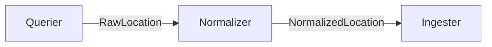

# ETL

Data pipeline for collecting, normalizing, and storing circular economy locations.

## Pipeline

Each pipeline has a **Querier** that fetches raw data from a source and a **Normalizer** that maps it to the shared schema. The **Ingester** is shared across pipelines and handles persistence.

## Adding a pipeline

1. Create a new directory under [`pipelines/`](pipelines/) for your source (e.g. `pipelines/openstreetmap/`)
2. Implement [`BaseQuerier`](base/querier.py) in `querier.py` — `fetch()` should return a `list[RawLocation]`, handling pagination internally
3. Implement [`BaseNormalizer`](base/normalizer.py) in `normalizer.py` — `normalize()` should map each [`RawLocation`](dtos.py) payload to a [`NormalizedLocation`](dtos.py)
4. Add a `test_pipeline.py` alongside them

See [`pipelines/example/`](pipelines/example/) for a reference implementation.
