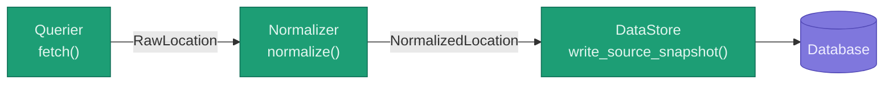

# ETL

Data pipeline for collecting, normalizing, and storing circular economy locations.

## Pipeline


```mermaid
flowchart LR
    Q["Querier\nfetch()"] -->|RawLocation| N["Normalizer\nnormalize()"]
    N -->|NormalizedLocation| I["DataStore\nwrite_source_snapshot()"]
    I --> DB[(Database)]

    classDef source fill:#1D9E75,stroke:#0F6E56,color:#E1F5EE
    classDef sourceTable fill:#7F77DD,stroke:#534AB7,color:#EEEDFE

    class Q,N,I source
    class DB sourceTable
```

Each pipeline has a **Querier** that fetches raw data from a source and a **Normalizer** that maps it to the shared schema. The **DataStore** is shared across pipelines and handles persistence.

## Adding a pipeline

1. Create a new directory under [`src/etl/sources/`](src/etl/sources/) for your source (e.g. `src/etl/sources/openstreetmap/`)
2. Implement [`BaseQuerier`](src/etl/base/querier.py) in `querier.py` — `fetch()` should return a `list[RawLocation]`, handling pagination internally
3. Implement [`BaseNormalizer`](src/etl/base/normalizer.py) in `normalizer.py` — `normalize()` should map each [`RawLocation`](src/etl/dtos.py) payload to a [`NormalizedLocation`](src/etl/dtos.py)
4. Add tests under [`tests/`](tests/), mirroring the source path (e.g. `tests/sources/openstreetmap/test_pipeline.py`)

See [`src/etl/sources/google_places/`](src/etl/sources/google_places/) for a reference implementation.

## Querier

The [`BaseQuerier`](src/etl/base/querier.py) is implemented once per pipeline and fetches raw data from a single source. You implement it per source.

Key behaviors:

- **`fetch()`** — returns a `list[RawLocation]`, handling pagination internally so the rest of the pipeline doesn't need to think about it.

## Normalizer

The [`BaseNormalizer`](src/etl/base/normalizer.py) is implemented once per pipeline and maps source-specific data to the shared schema. You implement it per source.

Key behaviors:

- **`normalize()`** — maps each `RawLocation` payload to a `NormalizedLocation`, translating source-specific field names and formats into the shared schema.

## DataStore

The [`DataStore`](src/etl/base/data_store.py) reads and writes data for persistant storage. It is shared across all pipelines — you do not implement it per source.

Key behaviors:

- **`write_source_snapshot()`** — writes a list of `NormalizedLocation` records to the database.
  - **Update or Create** — records are keyed on `(data_source, data_source_id)`. Existing records are updated in place; new records are inserted.
  - **Source** — every record retains its `data_source` and `data_source_id`, which makes cross-source deduplication tractable later without requiring it now.

## MergeProcessor

The [`MergeProcessor`](src/etl/merge_processor.py) deduplicates and merges locations across data sources. It takes normalized location data from multiple sources and produces a unified list where duplicates have been identified and merged.

### How it works

**Stage 1: group()** — Generates and evaluates candidate location pairs:
1. **Distance gating** — only pairs within 150m are considered (prevents false matches across the city)
2. **Cascade evaluation** — applies matching rules in priority order:
   - `PHONE` tier: same phone number (most reliable)
   - `ADDRESS` tier: same house number and street name (strong signal)
   - `NAME` tier: similar business names via fuzzy matching (fallback)

**Stage 2: prioritize()** — Sorts matched pairs and performs one-to-one assignment:
1. **Sort by quality** — orders matches by tier (PHONE > ADDRESS > NAME), then distance, then ID for stability
2. **One-to-one assignment** — each location used in at most one match group (prevents contradictions)
3. **Add unmatched** — locations without matches become single-source groups

**Stage 3: merge()** — Merges each match group into a single location:
- Most fields: first non-empty value (Google → OSM priority)
- `lat`/`lon`: taken as a pair from one source (never averaged)
- `address`: taken as a unit from the most complete source
- `contact`: merged per subfield (phone from Google, email from OSM, etc.)
- `services`: union across sources, deduplicated
- `availability`: prefers source with `opening_hours`
- `last_verified`: latest date

**Output:** One `NormalizedLocation` per real-world business, with the most complete data from all sources.

### Matching details

**Phone normalization** ([`phonenumbers`](https://pypi.org/project/phonenumbers/)): Handles format variations (`617-555-0100`, `(617) 555-0100`, `+1 617 555 0100`), extensions, semicolon-separated multi-value tags, and vanity numbers.

**Address normalization** ([`usaddress-scourgify`](https://pypi.org/project/usaddress-scourgify/)): Canonicalizes street suffixes (`Street` → `ST`, `Avenue` → `AVE`) and directionals. Extracts unit designators (`Apt 15`, `Ste 405`, `#15`) and compares only the identifier to handle different unit types referring to the same physical location.

**Name similarity** ([`rapidfuzz`](https://pypi.org/project/rapidfuzz/) + [`cleanco`](https://pypi.org/project/cleanco/)): Strips legal suffixes (`Inc`, `LLC`) and uses token-set matching to handle extra words (`Goodwill` vs `Goodwill Store & Donation Center`) and reordering.

**Unit veto rule**: If both locations have unit designators and they differ (e.g., `Ste 405` vs `Ste 200`), the ADDRESS tier rejects the match. This prevents merging different businesses in the same building.

### Configuration

Constants in [`matching.py`](src/etl/matching.py):
- `MAX_MATCH_DISTANCE_M = 150` — maximum distance for candidate pairs
- `NAME_SIMILARITY_THRESHOLD = 90` — token_set_ratio threshold (0-100)
- `STREET_SIMILARITY_THRESHOLD = 90` — street name fuzzy matching threshold

Source priority in [`field_merge.py`](src/etl/field_merge.py):
- `SOURCE_PRIORITY = [DataSource.GOOGLE_PLACES, DataSource.OPENSTREETMAP]`

### Example

```python
from pathlib import Path
from etl.merge_processor import MergeProcessor
from etl.local_data_store import LocalDataStore
from etl.dtos import DataSource

store = LocalDataStore(Path("data"))
locations_by_source = {
    DataSource.GOOGLE_PLACES: store.read_source_snapshot(DataSource.GOOGLE_PLACES),
    DataSource.OPENSTREETMAP: store.read_source_snapshot(DataSource.OPENSTREETMAP),
}

processor = MergeProcessor()
merged_locations = processor.process(locations_by_source)

store.write_output_locations(merged_locations)
```

See [`src/etl/jobs/merge_process_to_local.py`](src/etl/jobs/merge_process_to_local.py) for the full job implementation.

## Testing

Tests live under [`tests/`](tests/), mirroring the layout of `src/etl/`. Run them with:

```bash
uv run pytest
```

Shared fixtures (e.g. `make_location`, a factory for a valid `NormalizedLocation`) live in [`tests/conftest.py`](tests/conftest.py).
